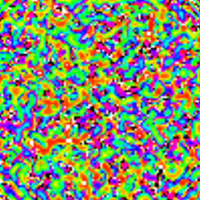

# Hodgepodge machine

If you don't know what is it, search the web. Short explanation follows,
though.

It is a 2d cellular automaton. There are healthy, infected and sick cells,
which follow the rules below:

- sick cell becomes healthy
- infected cell has a level of infection, which grows at constant rate plus
  addition from infection in neighbour cells; if level goes over threshold,
infected becomes sick
- healthy cell may become infected if there is enough infection / sickness
  nearby

## Requirements

Python 3 (maybe works with 2? didn't try); numpy; pygame.

## Usage

Just run `python hodgepodge.py`. Add `-h` if you want to see what tunable
parameters are there.

## Examples

## License

BSD 2-clause
